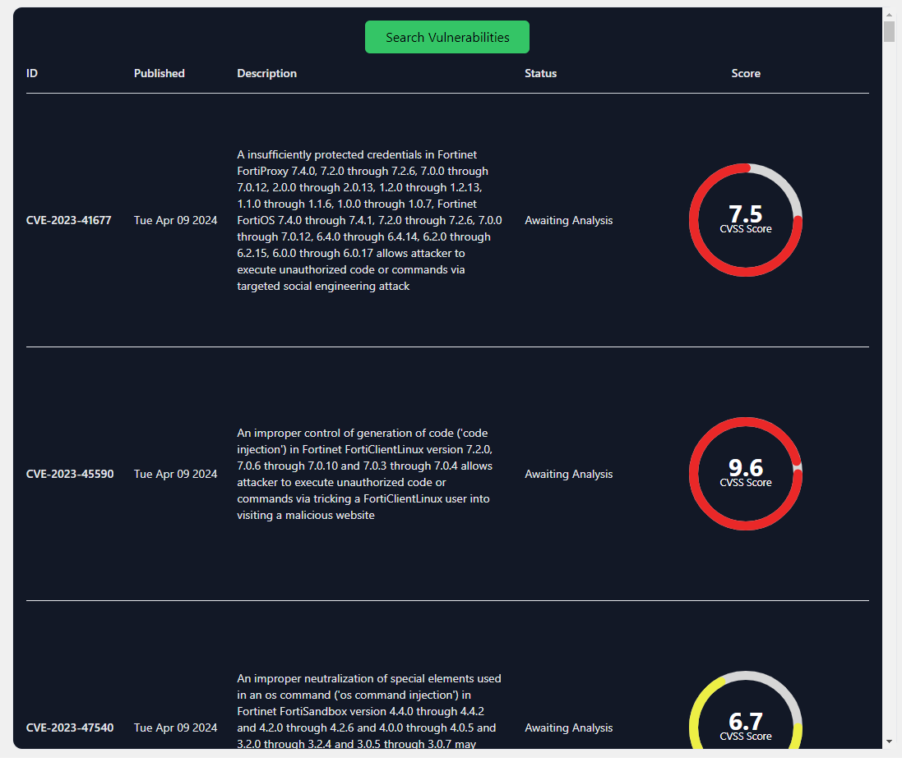
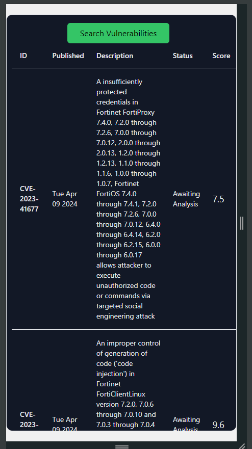

# Vulnerabilities Explorer

This is an application to fetch the latest vulnerabilities data from CVE with custom UI and database.

## Requirements
- Should check the newly reported vulnerabilities and save the relevant information to the database.
- Should implement validation on the database side by using procedures and transactions.
- Should render the relevant information to the frontend side (mobile responsiveness)
- Should display a chart that displays the cvss score for each vulnerabilities. Attached the image.

## Tech Stacks
- React + Vite + TypeScript
- Golang
- PostgreSQL

## Third-party API Service

The CVE API is used to easily retrieve information on a single CVE or a collection of CVE from the NVD. The NVD contains 246,430 CVE records. Because of this, its APIs enforce offset-based pagination to answer requests for large collections. Through a series of smaller “chunked” responses controlled by an offset startIndex and a page limit resultsPerPage users may page through all the CVE in the NVD.

```
https://nvd.nist.gov/developers/vulnerabilities
```

## Challenges
### Error Handling
  
  Handling errors gracefully is essential when working with transactions.
  
  Transactions must be rolled back in case of errors to maintain data integrity.
  
  Proper error handling and logging mechanisms should be implemented to ensure that errors are captured and dealt with appropriately.

### Performance Considerations
  
  Transactions can have a performance impact, especially for long-running or complex transactions.
  
  Careful design and optimization of queries and procedures may be necessary to ensure acceptable performance.

## Setting up local PostgreSQL DB

You need to install PostgreSQL DB on your local and then create a new `.env` file inside server directory with DB credentials.

```
DB_USER=<YOUR_DB_USER_NAME>
DB_PASSWORD=<YOUR_DB_PASSWORD>
DB_NAME=<YOUR_DB_NAME>
DB_HOST=<YOUR_DB_HOST>
DB_PORT=<YOUR_DB_PORT>
DB_SSLMODE=disable
```

## Running the Frontend

In client directory, create a `.env` file based on `.env.example` by setting the local backend URL.
```
VITE_SERVER_BASE_URL=http://localhost:8000
```

Run the following commands to setup node modules and run the project locally.
```
cd client
nvm use 18 # Node.js v18 or later
npm install
npm run dev
```

Go to http://localhost:3000 to visit the frontend website. 

## Running the Backend

Run the following commands to download and install any Go dependencies the project has.

```
cd server
go get ./...
```

Run the project and go to http://localhost:8000 to visit the backend website.
```
go run main.go
```

## Screenshots



